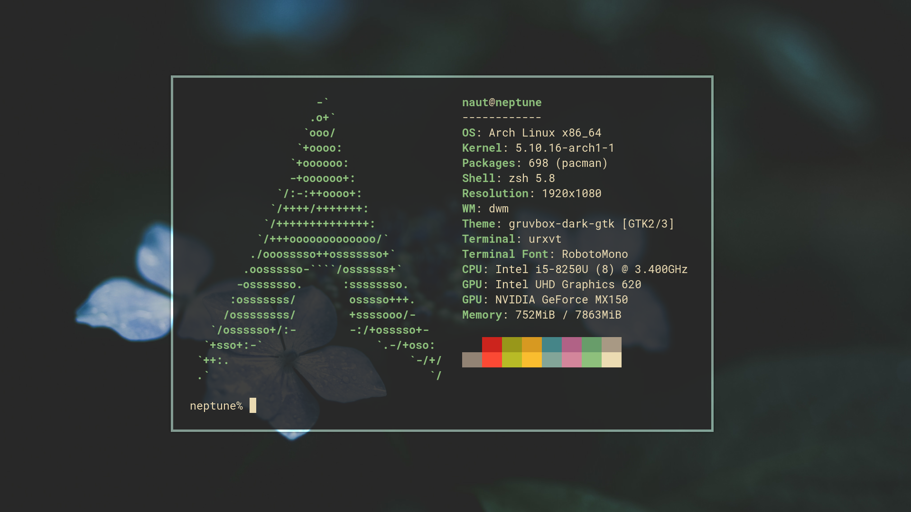

# ~/.dotfiles

My configuration files for my 2021 Arch Linux rice based around Gruvbox.



## Programs

+ __WM:__ [dwm](https://dwm.suckless.org/) + fullgaps + actualfullscreen
+ __GTK theme:__ [gruvbox-dark-gtk](https://aur.archlinux.org/packages/gruvbox-dark-gtk)
+ __launcher:__ [dmenu](https://tools.suckless.org/dmenu/)
+ __terminal:__ [urxvt](https://github.com/alacritty/alacritty) + zsh
+ __Editor:__ [vscode OSS](https://code.visualstudio.com/), [neovim-nightly](https://neovim.io/)
+ __Image Viewer:__ [feh](https://feh.finalrewind.org/)
+ __File Manager:__ [vifm](https://vifm.info/)
+ __bar:__ [slstatus](https://tools.suckless.org/slstatus/)
+ __browser:__ [brave](https://brave.com/), [firefox](https://www.mozilla.org/en-US/firefox/new/)

## Getting Started

In order to set up this rice you need to install Arch Linux and create a user. This can be done by following [the Arch Wiki](https://wiki.archlinux.org/index.php/Installation_guide).

Note: the automatic bootstrap script uses `sudo`, so you'll need to ensure your user is apart of the `wheel` group.

After installing everything and creating your user, clone the `.dotfiles` repo to `~/git/.dotfiles`.
```
mkdir -p ~/git
git clone https://github.com/jimDragon/.dotfiles.git ~/git/.dotfiles
```

After cloning the respository run the bootstrap script and follow the prompts.
```
~/git/.dotfiles/.local/bin/installenv.sh
```

Once this script completes you'll be loaded into my build of dwm window manager with everything configured according to my configs (and preferences).

### Manual

If you don't want to use the automatic script, symlink all the files to your home directory using the command `stow`.
```
cd ~/git
stow .dotfiles
```
Now that the config files are stowed, the environment should mostly be up and running.


#### Dependencies
There are various dependencies that are required to get this rice working perfectly. Most are in the Arch repos but you will need to install some stuff form the AUR. If you're setting this rice up on another distro just install the same applications with the equivalent commands.

Note: if you're using the automatic script you don't have to worry about installing these manually.
