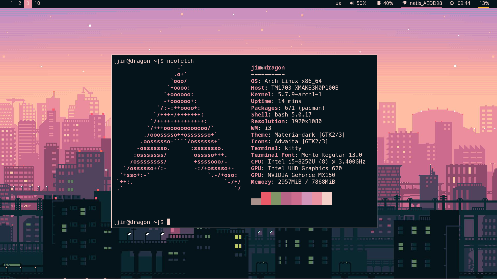

# .dotfiles



These are my system dotfiles, updated for my 2019 Arch setup. 

Uses GNU Stow – https://www.gnu.org/software/stow/

## Info
| Program        | Default |
|----------------|---------|
| Window Manager | [i3-gaps](https://github.com/Airblader/i3) |
| Terminal       | [kitty](https://github.com/kovidgoyal/kitty)|
| Editor         | [nvim Mach-2](https://github.com/ChristianChiarulli/nvim)|
| Theme          | [pywal](https://github.com/dylanaraps/pywal)|

## Usage
```
cd ~
git clone https://github.com/jimDragon/.dotfiles.git
cd .dotfiles
rm README.md
stow *
```
*or stow i3, bash, etc. if you want a specific config*
